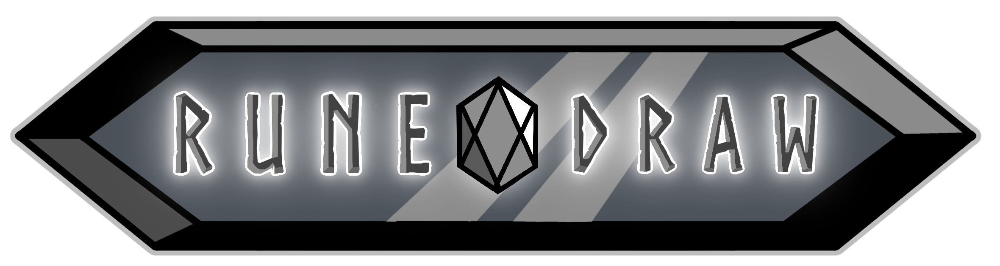

# Runedraw

Group project for UF Digital Worlds Convergence 2026

## Links

**Itch:** https://cidthunder.itch.io/runedraw
**Behance:** https://www.behance.net/gallery/245282559/RuneDraw

## Credits

Programmers
- Elijah Lowe, @elijahlowe77 - [Card Game System Design, Shaders]
- Jaxon Kundrat, @JaxThom113 - [Overworld Level Generation, UI/UX]

Artists
- Tyler Hudelson - [Project Manager, Audio Design]
- Duane Huynh - [3D Models, Environmental Design]
- Connor Benson - [Character / Card Design, UI Elements]
- Khaleed Kirkland - [Character / Card Design]

*A game by Jadeck Studios*